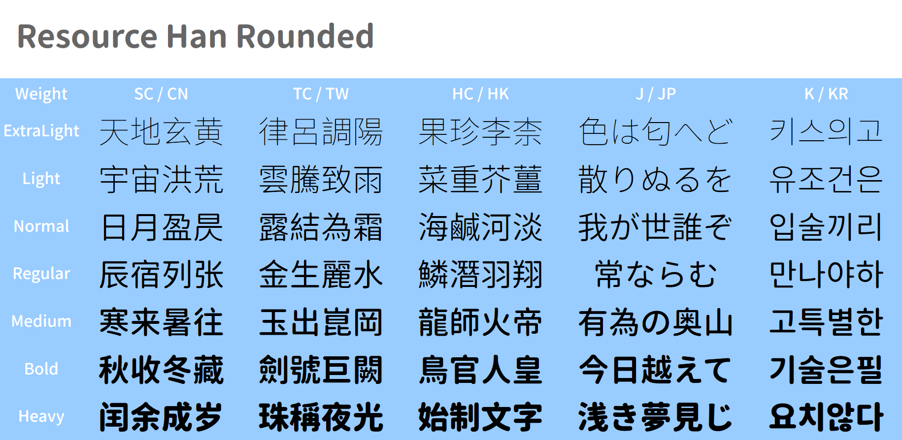

# Resource Han Rounded

This font is derived from [Source Han Sans](https://github.com/adobe-fonts/source-han-sans).



## Download the Fonts<br>下载字体

[Latest Release / 最新版](https://github.com/CyanoHao/Resource-Han-Rounded/releases).

* **TTF**: Each variant (J, K, SC, TC, HC) contains all glyphs, **recommended**.
* **TTC**: Pack 5 variants to a single `ttc` file.
* **CN**: contains almost all glyphs except Hangul.<br>包含除韩语谚文外的所有字符，**推荐简体中文用户使用**。
* **TW** / **HK**: supports Chinese characters (漢字) defined in Big5 character set.
* **JP**: supports kanji (漢字) defined in JIS character set.
* **KR**: supports all Hangul (한글), and Hanja (한자) defined in KS character set.

## How to Build

Dependencies: Python, [otfcc](https://github.com/caryll/otfcc), [otfcc-c2q](https://www.npmjs.com/package/otfcc-c2q), [afdko](https://pypi.org/project/afdko/).

Put SHS files (OTF and Subset OTF) into `src/`, then
```bash
./configure
make -j<threads>
```

**Note**: `make`-ing all variants × all weights will take hours and much disk space. To make a specific font, run
```bash
make out/ResourceHanRounded<var>-<w>.ttf
```
where `<var>` can be one of `J`, `K`, `SC`, `TC`, `HC`, `JP`, `KR`, `CN`, `TW`, `HK`, and `<w>` can be one of `ExtraLight`, `Light`, `Normal`, `Regular`, `Medium`, `Bold`, `Heavy`.

## Credits

[Source Han Sans](https://github.com/adobe-fonts/source-han-sans) is a high quality open source typeface released by Adobe and Google.
