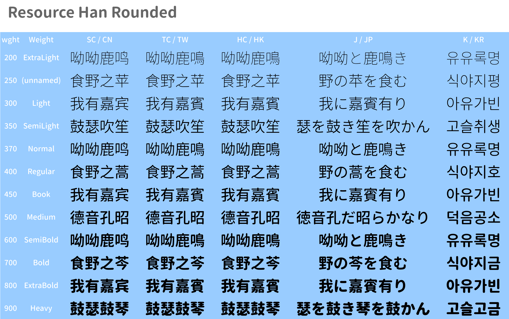
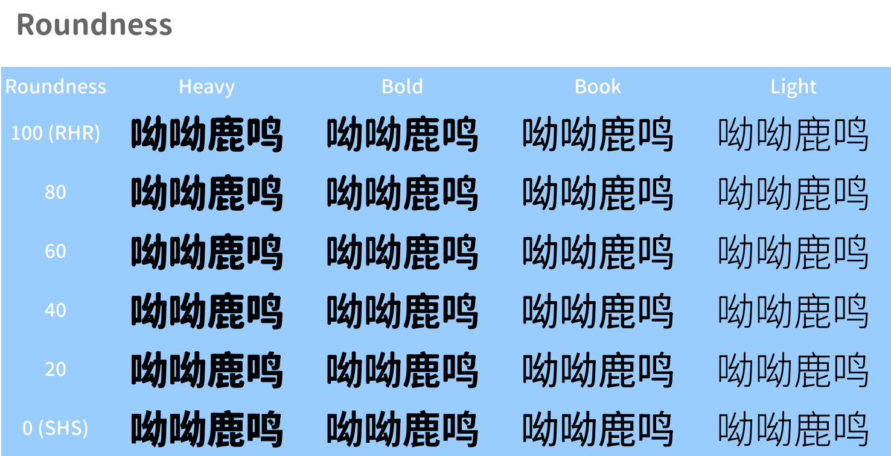

*Warranty: Resource Han Rounded Fonts are under SIL Open Font License (See [OFL-License.txt](./OFL-License.txt)) while other parts are not.*

# Resource Han Rounded

This font is derived from [Source Han Sans](https://github.com/adobe-fonts/source-han-sans).

[Live preview: font variation](https://nowar-fonts.github.io/rhr-next/)





## Download & Deployment Configurations

[Pre-release](https://github.com/CyanoHao/Resource-Han-Rounded/releases).

The pre-release currently only includes OpenType/CFF2 variable font configurations.

<!-- The pre-release currently includes OpenType/CFF2 variable font and OpenType/CFF1 instance (non-VF) configurations. -->

For usage with Microsoft Office series software, please visit [MSOffice-RHR](https://github.com/CyanoHao/MSOffice-RHR) for a shorter name version to prevent bugs in software.

### Configuration: OpenType/CFF2 Variable Font

OpenType/CFF2 variable font (theoretically) works with Windows 10 1803+, macOS 10.15+, Linux with FreeType 2.8+. However, latest OS releases are always recommended because early releases may have critical bugs like [source-han-sans#290](https://github.com/adobe-fonts/source-han-sans/issues/290) with this format.

* **OTC**: pack 5 language-specific OTFs to a single OTC file, recommended for latest OS.
* **OTF**: language-specific OTFs for developers and Windows 10 1809 users.
* **Subset OTF** (CN/TW/HK/JP/KR): region-specific subset OTFs, following [Source Han Sans](https://github.com/adobe-fonts/source-han-sans) notations.

<!-- ### Configuration: OpenType/CFF1 Instance

Desktop OSes since 2000 (or more specifically, Windows 2000+, MacOS 8.6+, Linux with FreeType 2.0+) support this format. However, support in applications may differ.

* **OTC**: pack 5 language-specific OTFs of same weight and roundness to an OTC file, recommended for Windows 10, macOS and Linux.
* **OTF**: language-specific OTFs for early Windows releases.
* **Subset OTF** (CN/TW/HK/JP/KR): region-specific subset OTFs, following [Source Han Sans](https://github.com/adobe-fonts/source-han-sans) notations. -->

## How to Build

Resource Han Rounded can be built on Linux or WSL (2).

Note: GNU userland is assumed in makefile. macOS is not tested.

**WARNING**: Each job requires ~12 GiB memory at peak.

Dependencies:

* [Node.js](https://nodejs.org/).
* [FontForge](https://fontforge.org/) for CFF1 optimisation.
* [7-Zip](https://www.7-zip.org/) or p7zip for packaging.

Put Source Han Sans variable OTF and subset OTF files (5 + 5 = 10 files) to `src/`, and run:

```bash
npm install
node configure.js >Makefile
make -j<n> all
```

Available `make` targets:

* OpenType/CFF2 variable font
  * `cff2-otc`: OTC file.
  * `cff2-vf`: OTFs and subset OTFs.
  * `dist-cff2-otc`: OTC distribution package (`RHR-CFF2-OTC-<version>.7z`).
  * `dist-cff2-otf`: OTFs distribution package (`RHR-CFF2-OTF-<version>.7z`).
  * `dist-cff2-subsetotf`: subset OTF distribution packages (`RHR-CFF2-<CN|TW|HK|J|K>-<version>.7z`).
* OpenType/CFF1 instance
  * `cff1-otc`: OTC files.
  * `cff1-instance`: OTFs and subset OTFs.
  * `dist-cff1-otc`: OTC distribution package (`RHR-CFF1-OTC-<version>.7z`).
  * `dist-cff1-otf`: OTFs distribution package (`RHR-CFF1-OTF-<version>.7z`).
  * `dist-cff1-subsetotf`: subset OTF distribution packages (`RHR-CFF1-<CN|TW|HK|J|K>-<version>.7z`).
* OpenType/TT hinted instance will be available later.

## Credits

[Source Han Sans](https://github.com/adobe-fonts/source-han-sans) is a high quality open source typeface released by Adobe and Google.
